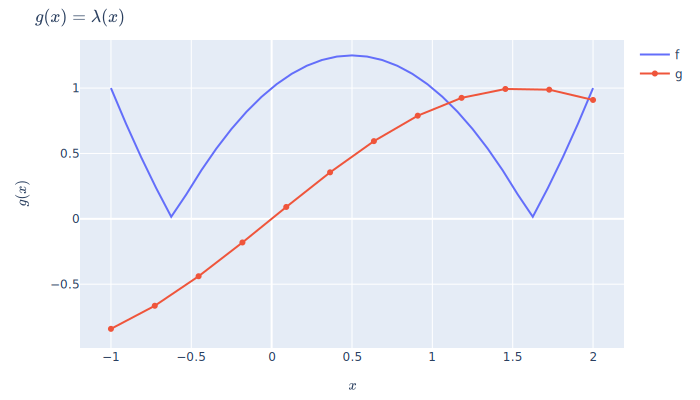

# RPC

Kamodo includes a Remote Call Procedure (RPC) interface, based on [capnproto](https://capnproto.org/). This allows Kamodo objects to both serve and connect to other kamodo functions hosted on external servers.

```python
from kamodo import Kamodo, kamodofy
import numpy as np
```

```python
k = Kamodo('f=x**2+y**2')
```

```python
k.evaluate('f', x=np.array([3,4,5]), y=np.array([6,7,8]))
```

First we'll initialize a Kamodo object to act as a server, using one pure function `f` initialized without defaults and one black-box function `g` with defaults.

```python
kserver = Kamodo(f='sqrt((x**2-x-1)**2)',
                 g = kamodofy(lambda x=np.linspace(-1, 2, 12): np.sin(x)))
kserver.to_latex()
```

\\begin{equation}f{\\left(x \\right)} = \\sqrt{\\left(x^{2} - x - 1\\right)^{2}}\\end{equation} \\begin{equation}g{\\left(x \\right)} = \\lambda{\\left(x \\right)}\\end{equation}


As a test, we'll evaluate `f` on the server.

```python
kserver.f(np.array([3, 4, 5]))

# >>> array([ 5., 11., 19.])
```

Now generate a server-side test plot for both functions.

```python
import plotly.io as pio
fig = kserver.plot('g', f=dict(x=np.linspace(-1,2,33)))

pio.write_image(fig, 'notebooks/images/rpc-plot.svg')
```


To test the RPC features, we'll create a read/write socket pair.

```python
import socket

read, write = socket.socketpair()
```

```python
server = kserver.server(write)
```

Now we'll initialize an empty kamodo object to act as a client.

```python
kclient = Kamodo()

client = kclient.client(read)

kclient.to_latex()
```

\\begin{equation}f{\\left(x \\right)} = \\sqrt{\\left(x^{2} - x - 1\\right)^{2}}\\end{equation} \\begin{equation}g{\\left(x \\right)} = \\lambda{\\left(x \\right)}\\end{equation}


The client now has access to the functions hosted on the server. This allows the client to call server-side functions without needing any of their dependencies!


Client functions inherit the defaults of their server-side counterparts.

```python
from kamodo import get_defaults

get_defaults(kclient.g)

# >>> {'x': array([-1.        , -0.72727273, -0.45454545, -0.18181818,  0.09090909,
#          0.36363636,  0.63636364,  0.90909091,  1.18181818,  1.45454545,
#          1.72727273,  2.        ])}
```

Arguments are automatically converted to numpy arrays before being passed to the server.

```python
kclient.f([3, 4, 5])

# >>> array([ 5., 11., 19.]) # matches above evaluation on server
```

We can verify that the clientside plots reproduce that found on the server.

```python
fig = kclient.plot('g', f=dict(x=np.linspace(-1,2,33)))

pio.write_image(fig, 'notebooks/images/rpc-plot2.svg')
```



<!-- #region -->
# RPC Spec

Kamodo uses capnproto to communicate binary data between functions hosted on different systems. This avoids the need for json serialization and allows for server-side function pipelining while minimizing data transfers.

Kamodo's RPC specification file is located in `kamodo/rpc/kamodo.capnp`:

```sh
{! ../kamodo/rpc/kamodo.capnp !}
```

The above spec allows a Kamodo client (or server) to be implemented in many languages, including [C++](https://capnproto.org/cxx.html), C# (.NET Core), Erlang, Go, Haskell, JavaScript, OCaml, and Rust.

Further reading on capnproto may be found here: 

* [Overview](https://capnproto.org/index.html)
* [Schema language](https://capnproto.org/language.html)
* [RPC](https://capnproto.org/rpc.html)
* Python implementation - [pycapnp](http://capnproto.github.io/pycapnp/quickstart.html)
<!-- #endregion -->

```python

```
